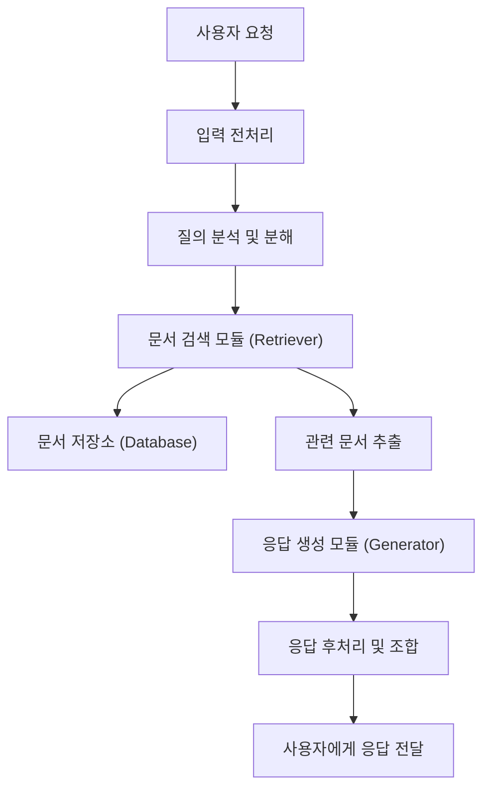

# 프로젝트 계획서

## 1. 목표

### 1.1 제목: 전주대학교 학생 맞춤형 Langchain LLM 챗봇 시스템 개발

### 1.2 목표: 
본 과제는 전주대학교 재학생과 신입생들을 위한 질문과 답을 받을 수 있는 Langchain 기반의 LLM 챗봇 시스템을 개발하는 것을 목표로 한다. 챗봇은 학생들이 수업, 학사 일정, 동아리 활동 등 다양한 대학 관련 정보를 쉽게 얻을 수 있도록 도와줄 것이다. 이를 통해 학생들의 학습 및 생활 편의성을 향상시키고, 학교와의 소통을 원활하게 한다.

## 2. 구성원 및 역할

- #### 권윤형
  - 프로젝트 관리 및 진행
- #### 장대현
  - 시스템 설계 및 구현
- #### 최장호
  - 챗봇 개발 및 데이터 처리

## 3. 개발 내용
### 3.1 주요 개발 내용

### Langchain 모델 구현
- Langchain을 활용하여 대화형 AI 시스템 구축
- 전주대학교 관련 데이터(학사 일정, 수업 정보 등) 통합

### 챗봇 학습 데이터 수집
- 전주대학교 관련 질문 및 답변 데이터 수집
- 향후 학생들이 자주 묻는 질문에 대한 Q&A 데이터베이스 구축

### 대화형 인터페이스 구축
- 직관적이고 사용하기 쉬운 챗봇 인터페이스 개발
- 학생들이 쉽게 접근하고 사용할 수 있도록 UI/UX 최적화

### 테스트 및 피드백
- 개발된 시스템에 대한 테스트 진행
- 학생들의 피드백을 반영하여 개선 작업 수행

### 배포 및 유지보수
- 시스템을 전주대학교 학생들에게 배포
- 지속적인 업데이트 및 개선 작업 수행

#### A. SW Flow

### B. 기능 정의

#### B.1 전체 기능

#### B.2 세부 기능

## 3. 결과물

결과물
